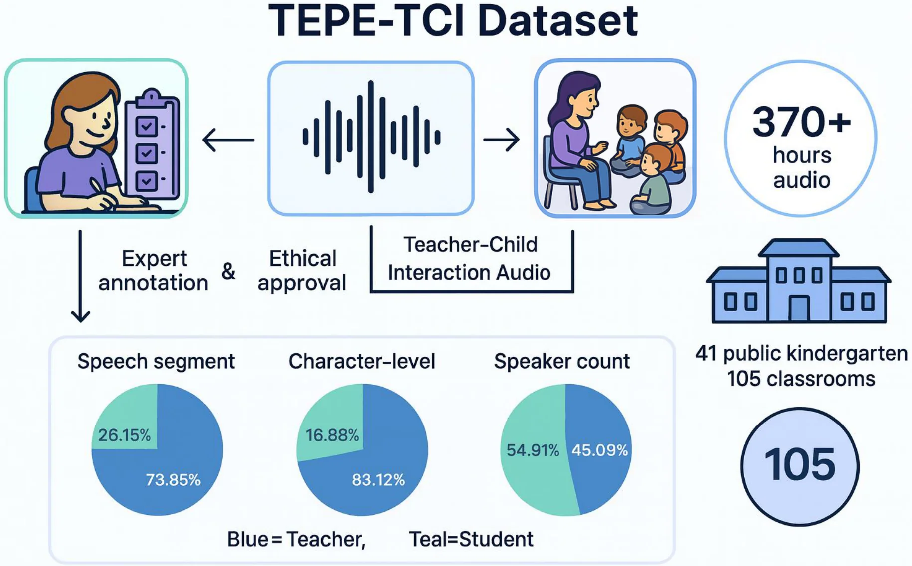

# CLAUDE.md

This file provides guidance to Claude Code (claude.ai/code) when working with code in this repository.

## Project Overview

This is a promotional single-page website for the AIED 2026 paper "When AI Meets Early Childhood Education: Large Language Models as Assessment Teammates in Chinese Preschools." It is deployed to GitHub Pages at https://qingyonghu.github.io/Interaction2Eval/.

**Technology Stack**: Pure HTML/CSS/JavaScript with no build tools or framework dependencies.

### Key External Dependencies

- **Chart.js 4.4.3** (CDN: jsdelivr) — Interactive horizontal bar charts for model agreement comparison
- **Font Awesome 6.4.0** (CDN: cdnjs) — Icons for More Works dropdown and UI elements
- **mapmyvisitors.com** — Visitor tracking map widget

## Code Architecture

### Module Pattern

All JavaScript in `assets/js/main.js` uses IIFE (Immediately Invoked Function Expression) modules to avoid global namespace pollution:

```javascript
(function initFeatureName() {
  // Feature implementation
  const io = new IntersectionObserver(...);
  // ...
})();
```

Each feature is self-contained and checks for required DOM elements before initializing.

### Scroll-Triggered Animations

The website uses `IntersectionObserver` extensively for scroll-triggered effects:

- **Reveal animations** (`.reveal` class) — Fade-in up animation when elements enter viewport
- **Animated counters** (`[data-count]` attribute) — Numbers animate from 0 to target value with cubic easing
- **Progress bars** (`[data-pct]` attribute) — Stat bars and efficiency bars animate width when scrolled into view

All animations trigger once and then unobserve the element to prevent re-animation.

### Chart.js Custom Plugin

A custom plugin `barDatalabels` is registered to display percentage values inline to the right of each bar:

```javascript
Chart.register({
  id: 'barDatalabels',
  afterDraw(chart) { /* draws text labels */ }
});
```

### CSS Custom Properties

All colors, spacing, shadows, and transitions are defined as CSS custom properties in `:root`:

- `--primary`: #2563eb (blue)
- `--accent`: #7c3aed (purple)
- `--text`: #0f172a, `--text-sec`: #475569, `--text-muted`: #94a3b8
- `--radius-sm`: 8px, `--radius-md`: 12px, `--radius-lg`: 20px

### Performance Optimizations

1. **WebP Images**: All figures in `figs/` use `.webp` format (46-92% smaller than PNG). Source PDF files are kept in `figs/` but not referenced in HTML.

2. **Lazy Loading**: Below-fold images use `loading="lazy" decoding="async"` attributes:
   ```html
   
   ```

3. **Mobile Particle Optimization**: The hero canvas particle system reduces particle density and skips O(n²) connection line drawing on mobile (`window.innerWidth < 768`).

4. **Non-Blocking External Resources**: Font Awesome and visitor map scripts are loaded with proper async/defer handling.

### Page Structure (Section IDs)

1. `#hero` — Hero section with particle canvas background
2. `#stats` — Animated counter stats (370h, 105 classrooms, etc.)
3. `#abstract` — Paper abstract with contribution cards
4. `#dataset` — Dataset overview with stat bars (speech segments, speaker count)
5. `#framework` — Interaction2Eval pipeline with animated efficiency comparison
6. `#results` — Chart.js bar charts (ECQRS-EC, SSTEW), word cloud
7. `#deployment` — Pilot deployment statistics and feedback
8. `#authors` — Author grid with photos (3×2 layout)
9. `#citation` — BibTeX citation with copy button
10. `#contact` — Contact information for corresponding author
11. Footer — Visitor map, conference link, paper download

## Common Development Tasks

### Adding a New Chart

1. Add `<canvas id="newChart"></canvas>` to HTML
2. In `assets/js/main.js`, create chart instance:
   ```javascript
   const newCtx = document.getElementById('newChart');
   if (newCtx) {
     new Chart(newCtx, {
       type: 'bar',
       data: { /* dataset */ },
       options: barOpts('#2563eb') // or custom options
     });
   }
   ```

### Adding Author Photos

Place images in `bio/` directory. Naming convention: `Firstname Lastname.jpg` (e.g., `Qingyong Hu.jpg`). Add fallback `onerror` handler to initials avatar:

```html
AB</div>'" />
```

### Converting Images to WebP

```bash
cd figs/
python -c "
from PIL import Image
import os
for f in os.listdir('.'):
    if f.endswith('.png'):
        img = Image.open(f)
        img.save(f.replace('.png', '.webp'), 'webp', quality=85, method=6)
"
```

### Updating More Works Dropdown

Edit the dropdown in `index.html` (lines ~82-104). Each work item needs:
- Badge class for conference color (`work-item-badge--cvpr`, `--aaai`, `--gh`)
- Work title and description in `.work-item-info`
- Target URL

### Testing Locally

Simply open `index.html` in a browser. No build process or local server required. For testing features that require HTTPS (like clipboard API), use a local server:

```bash
# Python 3
python -m http.server 8000

# Node.js
npx serve
```

## Deployment

The site is deployed to GitHub Pages from the `main` branch at root path `/`. Push to `main` branch triggers automatic deployment (1-3 minute delay).

**Note**: Git may have proxy settings configured. If push fails with connection errors, try:
```bash
git -c http.proxy= -c https.proxy= push origin main
```

## Important Notes

1. **Protocol-relative URLs**: External scripts must use `https://` explicitly, not `//`. Protocol-relative URLs fail when opening HTML files locally (`file://` protocol).

2. **CSS Organization**: Styles are organized with clear comment headers (`/* ===== Section Name ===== */`). Maintain this pattern when adding new styles.

3. **Mobile-First Responsiveness**: CSS media queries at `@media (max-width: 768px)` handle mobile layouts. Test responsive behavior when modifying layout-related CSS.

4. **Visitor Map**: The map widget from mapmyvisitors.com requires the script to use `https://` protocol to load correctly. The widget ID and parameters are in the visitor map section.
